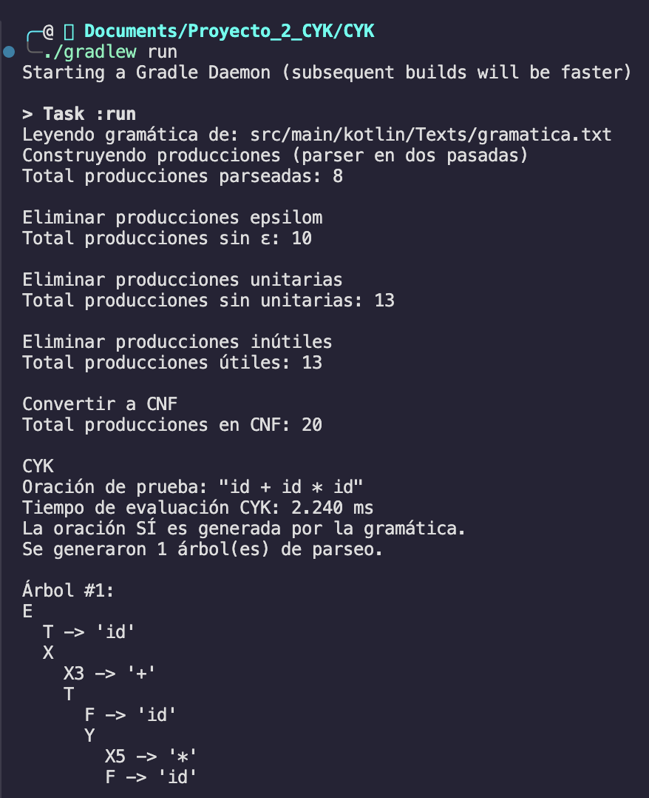
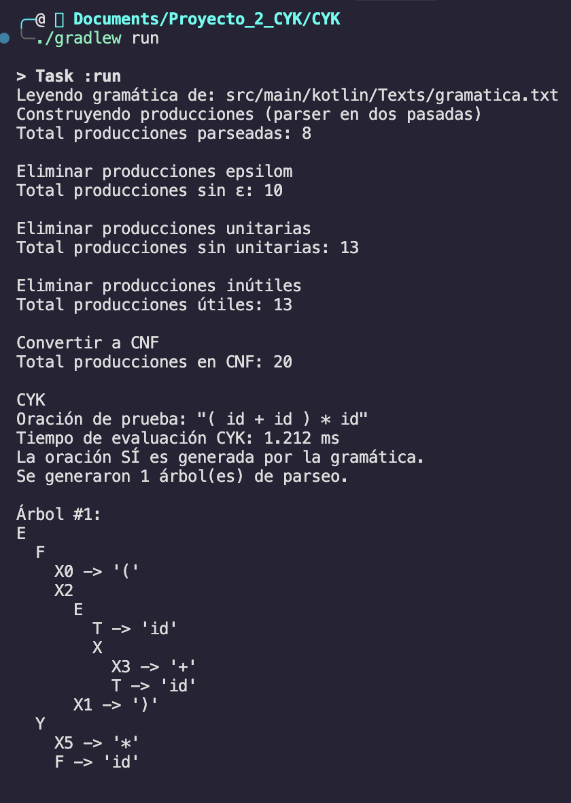
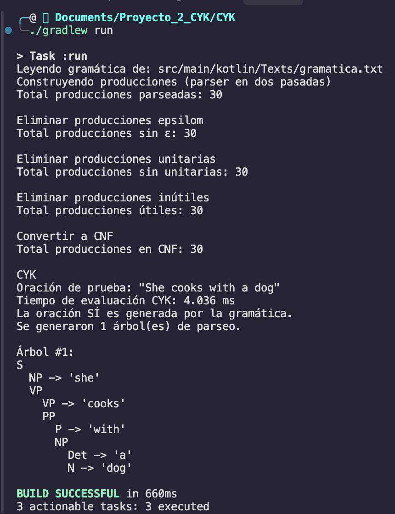
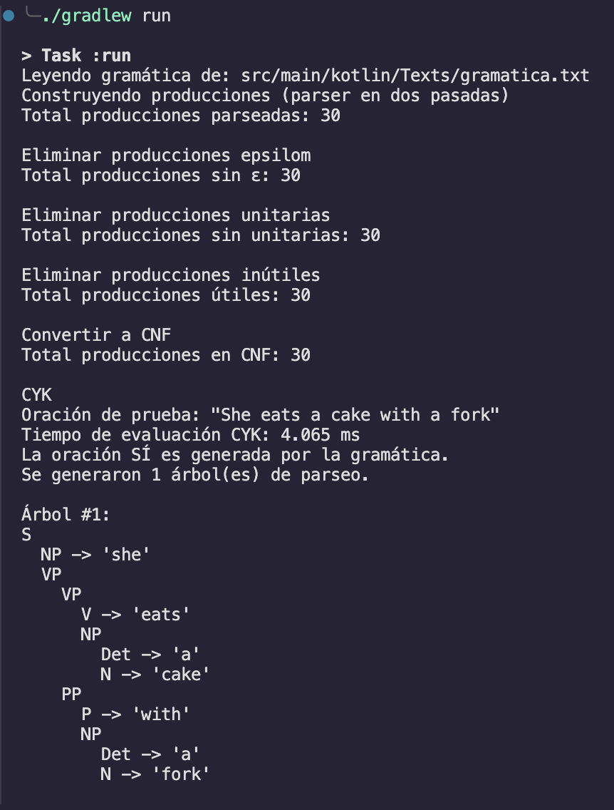
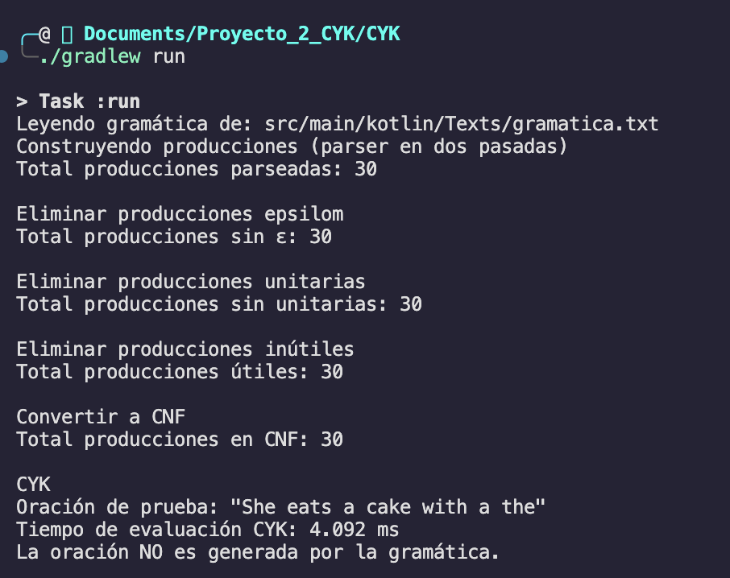

# Proyecto 2 - Conversión a CNF y CYK

El proyecto se encarga de tomar una gramática, la cual se encuentra en `/Texts/gramatica.txt`, la convierte a forma normal de Chomsky, pasando por cuatro pasos: eliminar producciones epsilom, eliminar unitarias, eliminar inútiles, y pasar a CNF modificando las producciones para que cumplan con la forma A->a, o A->BC. Posteriormente, al tener la nueva lista de producciones se aplica el CYK para decidir si una oración puede ser generada por la gramática o no.

# Diseño de la aplicación

**Estructura del proyecto**

```
src/main/kotlin/
├─ Gramatica/
│  ├─ model/
│  │  ├─ Production.kt        // data class Production(left: String, right: List<String>)
│  │  └─ SymbolTable.kt       // objeto global: nonTerminals, terminals, EPS, start
│  ├─ utils/
│  │  └─ Parser.kt            // buildProductions(lines): 2 pasadas (LHS → NTs; RHS → reglas)
│  ├─ RemoveEpsilom/          // eliminación de ε (epsilon)
│  ├─ RemoveUnary/            // eliminación de unitarias (A → B)
│  ├─ RemoveUseless/          // eliminación de símbolos no productivos/no alcanzables
│  └─ TurnToChomsky/          // establecer que las producciones estén en la forma normal de Chomsky
├─ CYK/
│  └─ CYK.kt                  // CYK + ParseTree
└─ Main.kt                    // se ejecutan todos los pasos y se dice si se acepta o no una oración
```

**Flujo**

1.	Parseo (buildProductions):

- Primera pasada: recolecta LHS -> llena SymbolTable.nonTerminals y start.

- Segunda pasada: tokeniza RHS (| separa alternativas) -> crea Production.

- Finalmente reconstruye terminals (todo token RHS no presente en NTs y != EPS).

2.	RemoveEpsilom:

- Encuentra anulables, genera combinaciones eliminando posiciones anulables.

- Elimina reglas A -> ε explícitas.

3.	RemoveUnary:

- Se encarga de reemplazar todas las producciones unitarias, por las producciones que genera el no terminal que se producía.

4.	RemoveUseless:

- Productivos: símbolos que pueden derivar a terminales.

- Alcanzables desde start.

- Filtra reglas para que solo queden aquellas que no incluyan no generadores o inalcanzables.

5.	TurnToChomsky:

- Reemplazar terminales en RHS de longitud >= 2 por NT nuevos.

- Cuidar que las producciones que tienen no terminales, solamente tengan 2 no terminales.

6.	CYK:
- Construye índices: terminalMap[a] = {A}, pairMap[(B,C)] = {A}.

- Llena table por longitudes (1..n) y splits.

- Acepta si start ∈ table[0][n].

- Reconstruye el parse tree con backpointers.

# Discusión

**Obstáculos Encontrados**

- Cuando estabamos planeando la parte de pasar a CNF, al estar realizando las primeras pruebas nos dimos cuenta que solamente estabamos tomando en cuenta los casos directos, por ejemplo, al remover producciones epsilom, solo tomábamos en cuenta que se quitaba si directamente teníamos un no terminal A que produciera epsilom, sin tomar en cuenta la posibilidad, que tal vez había un no terminal B que produjera a A, y que por ende, también debía ser tomado como anulable, posteriormente a darnos cuenta tuvimos que ir haciendo ajustes.

- Hubo un punto en donde nos encontramos constantemente sacando quienes eran los no terminales y terminales de la gramática, para facilitarnos el proceso de diseño hicimos el object de SymbolTable para que desde cualquier lugar tuvieramos acceso a ellos, y a poder validar si algo era no terminal o terminal.

- Un refactor que se tuvo que hacer, es que previamente en mi modelo de `Production` left era de tipo **Char** y right era de tipo **List<Char>**, esto nos causo problemas, ya que al ver la gramática con la que tendríamos que trabajar, no iba a funcionar, por ejemplo, se tenía Det -> a | the, en vez de algo como A -> a, por lo que tuvimos que modificar para trabajar con **String** en vez de **Char**.

- Comprender el algoritmo de CYK, y esto fue lo que más se nos complico, tratamos de leer al respecto, pero no nos hacía mucho sentido, por lo que terminamos buscando vídeos en YouTube, y ya al analizar los ejemplos lentamente logramos entender cómo funcionan, los vídeos fueron:

    - Este es un vídeo más detallado: youtube.com/watch?v=N8d4kkfxM-s&pp=ugMICgJlcxABGAHKBQNDWUs%3D

    - Este fue más corto, pero fue el ejemplo que tomamos de guía: https://www.youtube.com/watch?v=OZrTBiIWE6s


**Recomendaciones**

- Si se tuviera que hacer de cero el proyecto, tratar que conforme se va construyendo cada método para alcanzar la CNF, se vaya validando con algún ejemplo que se haya hecho en la clase, o que se encuentre en internet, solo para poder validar que el código que se está escribiendo, cumpla con el objetivo que se tiene en mente.

- Aunque varias personas no lo recomienden, utilizar prints para debuggear el código resulta bastante útil por temas de simplicidad para detectar qué ocurre en el código.

# Explicación de Lógica del Código

A continuación, se comparte un enlace a un video en el que se explica la lógica detrás del código, y al final, se prueba su funcionamiento con dos pruebas, en la primera se utiliza la gramática que tiene palabras en inglés, y en la segunda una gramática que no está en CNF:

https://uvggt-my.sharepoint.com/:v:/r/personal/mar23542_uvg_edu_gt/Documents/Proyecto%20%232.mp4?csf=1&web=1&e=8dmY1n&nav=eyJyZWZlcnJhbEluZm8iOnsicmVmZXJyYWxBcHAiOiJTdHJlYW1XZWJBcHAiLCJyZWZlcnJhbFZpZXciOiJTaGFyZURpYWxvZy1MaW5rIiwicmVmZXJyYWxBcHBQbGF0Zm9ybSI6IldlYiIsInJlZmVycmFsTW9kZSI6InZpZXcifX0%3D

# Ejemplos de Pruebas

1) Pruebas con gramática aritmética

Estas pruebas se ejecutaron con esta gramática:

```
E -> T X
X -> + T X | e
T -> F Y
Y -> * F Y | e
F -> ( E ) | id
```





2) Pruebas con gramática de inglés

Estas pruebas se ejecutaron con esta gramática:

```
S  -> NP VP
VP -> VP PP
VP -> V NP
VP -> cooks | drinks | eats | cuts
PP -> P NP
NP -> Det N
NP -> he | she
V  -> cooks | drinks | eats | cuts
P  -> in | with
N  -> cat | dog
N  -> beer | cake | juice | meat | soup
N  -> fork | knife | oven | spoon
Det-> a | the
```





